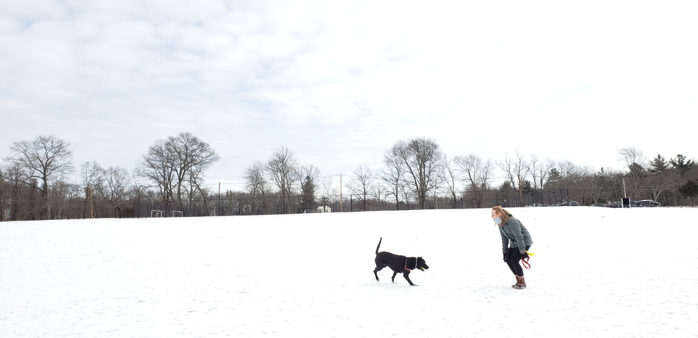

## About | [Portfolio](./portfolio.md) | [Resume](./resume.md) | [Contact](./contact.md)

# Welcome!
 
My name is Jess and I am an aspiring geospatial professional. I am pursuing my Master of Science in Geographic Information Science at Clark University and hold a Bachelor of Arts from Clark in Environmental Science with a Mathematics minor. 

I have experience with, and a curiosity for, a variety of software packages (*ArcGIS products, QGIS, TerrSet, GeoDa*) and programming languages (*R, Python, JavaScript*). I seek to bridge the communication gap between the technical and the non-technical to improve human-environment relations. 

In my free time, I enjoy rock climbing, rollerblading, hiking, and spending time with my dog, Mj.

