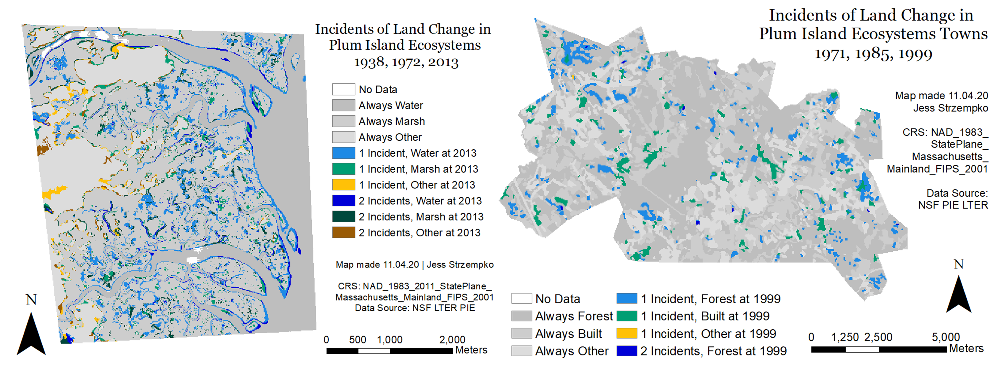

## [About](./README.md) | Portfolio | [Resume](./resume.md) | [Contact](./contact.md)

# Projects

#### Flow and Markov matrices for categorical transition extrapolation

*in progress work on Master's Thesis*

My Master's Thesis is a comparison of two kinds of transition matrices used for extrapolation: the Markov and Flow. I plan to receive my Master's degree in June 2021 and defend my research that summer. I will be presenting my findings at the annual meeting of the American Association of Geographers (AAG) in April 2021. My advisor is Dr. Robert Gilmore Pontius Jr.

#### Tutorial: PyQGIS 

*Final Project for IDCE 30274 Computer Programming for GIS*

I created a tutorial that serves as an introduction to QGIS and the use of Python scripting within QGIS. I additionally aimed to promote the use of open source software through a demonstration of its capabilities using the ACLED US Crisis Monitor dataset. 

#### Characterization of wetland scaling and influence in the Ipswich and Parker River watersheds of northeastern Massachusetts

*Summer 2020 Internship*

I received the Edna Bailey Sussman Fund Graduate Fellowship in Spring 2020 to work with Dr. Wilfred Wollheim of the University of New Hampshire's Water Systems Analysis Group on a research project examining hydrologic scaling this past summer. I will be presenting my findings in virtual poster form at the American Geophysical Union (AGU) Fall Meeting this December 2020.

#### Tutorial: Habitat Suitability Modeling using Random Forest Classification in Google Earth Engine

*Final Project for GEOG 397 Advanced Raster GIS*

I created a tutorial that walks users through a simple application of the Random Forest machine learning algorithm to habitat biodiversity modeling (HBM) of the vicugna in South America. [You can find the tutorial here.](https://github.com/jstrzempko/GEE-Random-Forest-HBM-Tutorial)

#### Examining Climate Change Impacts on Tropical Cyclones in the Western North Pacific using Vector GIS Spatial Analyst Tools

*Final Project for IDCE 388 Advanced Vector GIS*

My teammate, Caroline Williams, and I completed this project investigating the impacts of anthropogenic climate change on tropical cyclones in the Western North Pacific (WNP) Basin in the past century. Our work was framed within the context of risk and vulnerability, so we sought to understand the changing impact of these natural disasters on populations in Asia. We performed spatial analysis using kernel density, zonal statistics, and selection tools.

#### Burn Severity and Vegetation Recovery Analysis of the Anaktuvuk River Fire on the North Slope Tundra of Alaska

*Undergraduate Honors Thesis*

Completed in my senior year at Clark, my Honors Thesis observed trends in vegetation recovery at the site of the Anaktuvuk River Fire in Alaska for up to 12 years post-fire through a set of spectral indices: NBR, NDVI, and EVI. The primary purpose was to analyze the hypothesized relationship between burn severity and vegetation recovery. I defended my thesis in May 2020 and received High Honors.

#### Land Change Extrapolation for Virginia Coast Reserve with TerrSet's Land Change Modeler

*Final Project for GEOG 360 GIS & Land Change Models*

My group members, Rachel Corcoran-Adams, Elizabeth Lohr, and Julia Moore, and I performed land change extrapolations  for the Virginia Coast Reserve site of the Long Term Ecological Research Network with TerrSet’s Land Change Modeler (LCM). Using imagery from 1949, 1957, and 2013, we simulated and validated change among three land cover categories: Water, Marsh, and Upland. Two scenarios were run each with a set of distance to edge driver maps. We presented our findings at the Plum Island Ecosystems meeting in February 2020.

#### Mapping Our Way Through the Smog: Researching Ulaanbaatar Air Pollution in Ulaanbaatar, Mongolia

*Abroad Internship with the Ger Community Mapping Center*

In May 2019 during my semester abroad in Mongolia, I completed an internship with a local NGO, the Ger Community Mapping Center. The organization used GPS and AQI monitors to collect data from specific individuals about their daily commutes for the European Union Switch II Asia Program. I worked closely with my advisors, Anukhatan Tsevegmid and Batdorj Gongor, to create maps of air pollution exposure to particulate matter.

#### Melting Iceland: Mýrdalsjökull and Eyjafjallajökull

*Final Project for GEOG 296 Introduction to Remote Sensing*

My group members, Rowan Moody and Jessica Martinez, and I characterized changes in the extents of Icelandic glaciers by conducting land cover type classifications for a Landsat scene in the southern region of Iceland around the Mýrdalsjökull and Eyjafjallajökull glaciers across 3 time points: 1988, 1996, and 2014. We performed supervised classification to generate 5 categories of land cover: Sand, Snow/Ice, Vegetation, Water, and Clouds. We then compared areal extent of each class across the three years to investigate potential changes in land cover due to warming global temperatures.

#### Black-capped Chickadee Breeding Habitat Distribution in MA

*Final Project for GEOG 190 Introduction to GIS*

The main intent of this project was to familiarize myself with spatial analysis techniques through an examination of the natural breeding habitat of black-capped chickadee in Massachusetts based on criteria relevant to their nesting specifications. My work demonstrated how humans have increased viable breeding habitat for the black-capped chickadee according to criteria used. I gauged both the natural and manmade distribution of chickadee breeding grounds allowing speculation about present and future population dynamics.
